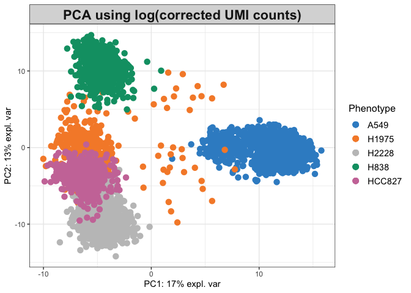
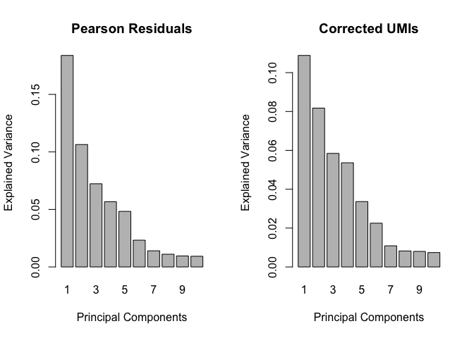
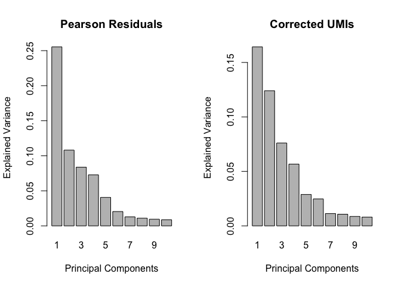
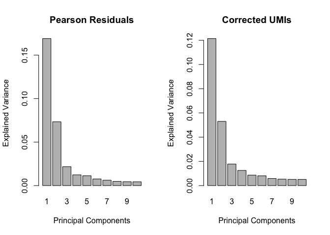

SCTransform Performance on CellBench Data
================

``` r
library(sctransform)
library(mixOmics) 
library(scater)
library(scran)
```

# The 5 cell line Data

Cells from five lung cancer cell lines. Details in
[here](https://github.com/LuyiTian/CellBench_data).

## 10X

``` r
pca_sctransform(sce_sc_10x_5cl_qc)
```

    ## Explained Variance for PCA of SCTransformed Data (run time: 16 s)

<!-- -->

    ## Sample Plots using Either Pearson Residuals or Corrected UMIs

<!-- --><!-- -->

    ## Sample Plots using scran-normalised data (run time: 68 s)

<!-- -->

## CEL-seq2 - plate 1

``` r
pca_sctransform(sc_Celseq2_5cl_p1, cell_line_colname = "cell_line_demuxlet")
```

    ## Explained Variance for PCA of SCTransformed Data (run time: 4 s)

<!-- -->

    ## Sample Plots using Either Pearson Residuals or Corrected UMIs

<!-- --><!-- -->

    ## Sample Plots using scran-normalised data (run time: 1 s)

<!-- -->

## CEL-seq2 - plate 2

``` r
pca_sctransform(sc_Celseq2_5cl_p2, cell_line_colname = "cell_line_demuxlet")
```

    ## Explained Variance for PCA of SCTransformed Data (run time: 3 s)

<!-- -->

    ## Sample Plots using Either Pearson Residuals or Corrected UMIs

<!-- --><!-- -->

    ## Sample Plots using scran-normalised data (run time: 1 s)

<!-- -->

## CEL-seq2 - plate 3

``` r
pca_sctransform(sc_Celseq2_5cl_p3, cell_line_colname = "cell_line_demuxlet")
```

    ## Explained Variance for PCA of SCTransformed Data (run time: 2 s)

<!-- -->

    ## Sample Plots using Either Pearson Residuals or Corrected UMIs

<!-- --><!-- -->

    ## Sample Plots using scran-normalised data (run time: 1 s)

<!-- -->

# RNA mix

Diluted mixture of mRNA from 3 of the 5 cell lines (those most
phenotypically similar to each other) in different proportions to create
pseudo single
cells.

## CEL-seq2

``` r
pca_sctransform(sce2_qc, cell_line_colname = "mix")
```

    ## Explained Variance for PCA of SCTransformed Data (run time: 7 s)

<!-- -->

    ## Sample Plots using Either Pearson Residuals or Corrected UMIs

<!-- --><!-- -->

    ## Sample Plots using scran-normalised data (run time: 2 s)

<!-- -->

## SORT-seq

``` r
pca_sctransform(sce8_qc, cell_line_colname = "mix")
```

    ## Explained Variance for PCA of SCTransformed Data (run time: 7 s)

<!-- -->

    ## Sample Plots using Either Pearson Residuals or Corrected UMIs

<!-- --><!-- -->

    ## Sample Plots using scran-normalised data (run time: 2 s)

<!-- -->
